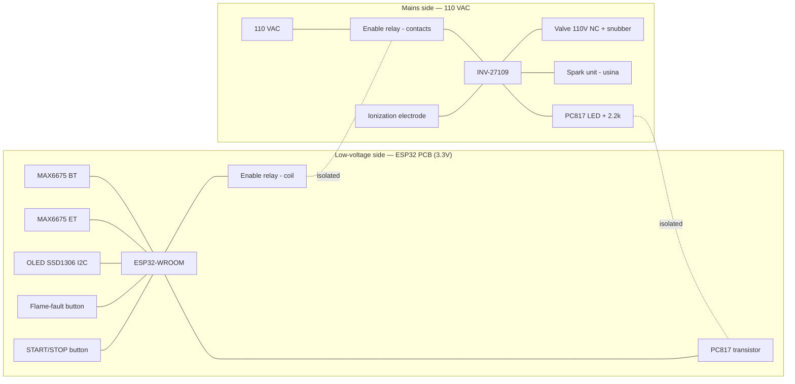

# Hardware wiring

Connection reference for the Torrador controller. **`src/board_config.h` is the
single source of truth for pin numbers** — change a pin there first, then update
this file. Pins are **provisional** (breadboard stage); they will be refined when
the PCB is designed.

Related: `../design-flame-control.md` (flame control, Architecture B) and the
controller manual `../manuals/Manual_INV_27109v9.1.pdf`.

> ⚠️ **Two voltage domains.** The ESP32 and its peripherals are **low-voltage
> (3.3V)**; the INV-27109 and the burner actuators are **mains (110 VAC)**. The
> two domains are **galvanically isolated** and only cross at two points — the
> enable relay and the PC817 optocoupler (see §5). Never join their grounds.

## 1. Block diagram

## 2. Bill of materials (BOM)

| Item | Qty | Notes |
|---|---|---|
| ESP32-WROOM DevKit | 1 | `esp32dev` |
| MAX6675 breakout (type-K, SPI) | 2 | BT + ET, both wired (shared SPI, separate CS) |
| Type-K thermocouple probe | 2 | BT (mass) + ET (air) |
| OLED SSD1306 0.96" I2C | 1 | addr `0x3C` |
| INV-27109 flame controller | 1 | 85–250 VAC; drives spark + valve, ionization sensing |
| Gas solenoid valve, **110 VAC, NC** | 1 | already sourced |
| Spark unit ("usina de centelha") | 1 | driven by INV S1 |
| Ionization electrode | 1 | flame sensing (INV) |
| Spark electrode | 1 | ignition |
| PC817 optocoupler | 1 | reads INV 12V fault → ESP |
| Resistor 2.2 kΩ, 1/4 W | 1 | PC817 LED series resistor |
| Relay module, mains-rated (~10A/250VAC), ESP-driveable | 1 | INV enable (power-gate) |
| RC snubber (~100Ω + 100nF X2) | 1 | across the valve coil |
| Push-button | 2 | bench: START/STOP (process) + flame-fault input |
| Drum-motor relay | 1 | future |

## 3. Low-voltage side — ESP32 PCB

| From (component) | Component pin | ESP32 pin | `board_config.h` | Notes |
|---|---|---|---|---|
| MAX6675 (BT) | VCC | 3V3 | — | ⚠️ **3.3V, not 5V** (SO level → ESP input) |
| MAX6675 (BT) | GND | GND | — | |
| MAX6675 (BT) | SCK | GPIO18 | `PIN_MAX6675_SCK` | shared clock |
| MAX6675 (BT) | SO  | GPIO19 | `PIN_MAX6675_SO`  | shared data (MISO) |
| MAX6675 (BT) | CS  | GPIO5  | `PIN_MAX6675_CS_BT` | |
| MAX6675 (ET) | VCC | 3V3 | — | ⚠️ **3.3V, not 5V** (SO level → ESP input) |
| MAX6675 (ET) | GND | GND | — | |
| MAX6675 (ET) | SCK | GPIO18 | `PIN_MAX6675_SCK` | shared clock — same node as BT |
| MAX6675 (ET) | SO  | GPIO19 | `PIN_MAX6675_SO`  | shared data — same node as BT |
| MAX6675 (ET) | CS  | GPIO4  | `PIN_MAX6675_CS_ET` | **D4** — ET's own chip-select |
| OLED SSD1306 | VCC | 3V3 | — | |
| OLED SSD1306 | GND | GND | — | |
| OLED SSD1306 | SDA | GPIO21 | `PIN_OLED_SDA` | I2C |
| OLED SSD1306 | SCL | GPIO22 | `PIN_OLED_SCL` | I2C |
| INV enable / bench LED | IN / anode | GPIO25 | `PIN_INV_ENABLE` | final HW: drives the INV mains relay (§4). Bench: GPIO25 → 330Ω → LED → GND (active-high) |
| PC817 (transistor) | collector | GPIO32 | `PIN_FLAME_FAULT` | final HW: **active-LOW** (fault ⇒ LOW), `INPUT_PULLUP` |
| PC817 (transistor) | emitter | GND | — | final HW only |
| Flame-fault button | — | 3V3 ↔ GPIO32 | `PIN_FLAME_FAULT` | bench: **active-high**, `INPUT_PULLDOWN` (pressed = flame fault → LOCKOUT). Final HW: the PC817 output above |
| START/STOP button | — | 3V3 ↔ GPIO33 | `PIN_START_STOP` | bench: **active-high**, `INPUT_PULLDOWN` (toggles the process on/off) |
| BOOT button (onboard) | — | GPIO0 | `PIN_BOOT_BUTTON` | lockout reset (short press); network reset later |
| Drum relay *(future)* | IN | GPIO26 | `PIN_RELAY_DRUM` | |

## 4. Mains side — 110 VAC (INV-27109)

> ⚠️ Confirm the **exact terminal numbers** against
> `../manuals/Manual_INV_27109v9.1.pdf` before wiring. Listed here by function.

| INV-27109 signal | Connects to | Notes |
|---|---|---|
| Power in (N/F, 85–250 VAC) | **110 VAC through the enable-relay contacts** | ESP turns the whole controller on/off by gating this supply |
| S1 (relay output) | Spark unit ("usina") | INV cycles it: 5s on / 3s off, 3 attempts |
| S2 (relay output) | **Solenoid valve (110V NC)** + **RC snubber across the coil** | INV holds S2 while flame is sensed |
| Flame sensor input | Ionization electrode | burner body must be well grounded (rectification reference) |
| Buzzer output (12 VDC, 20 mA max) | **PC817 LED** via 2.2 kΩ | fault/flame-loss signal → crosses to LV via the opto |

## 5. Isolation boundary (safety)

The low-voltage and mains domains meet at **exactly two** places — nowhere else:

1. **Enable relay** — the ESP drives the **coil** (low voltage, GPIO25); the
   **contacts** switch 110 VAC to the INV. Power off ⇒ INV off ⇒ **gas closes**.
2. **PC817 optocoupler** — the INV's 12V buzzer drives the **LED** (mains-referenced
   side); the **transistor** is read by the ESP (GPIO32). Light-only coupling.

**Do not** connect the INV's 12V ground (or any mains-referenced ground) to the
ESP ground. The independent mechanical gas-line safety backstop is **out of scope
of this firmware** (installer's responsibility) — see `../design-flame-control.md` §9/§12.

## 6. Bench test (no gas)

The current firmware (`src/main.cpp`) runs the burner control flow **without the
INV or any gas**:

- **START/STOP button (GPIO33):** toggles the process on/off.
- **Flame-fault button (GPIO32):** while firing, a press simulates the INV flame
  fault → the burner latches `LOCKOUT`.
- **Enable output (GPIO25) → LED** (GPIO25 → 330Ω → LED → GND): lit while the
  burner is firing (`RUN`).
- **BOOT button:** clears the `LOCKOUT`.
- **Min/max** are set over serial (`min <c>` / `max <c>` / `show`); unset ⇒ the
  flame stays on directly.
- The OLED shows the brand, BT temperature, the state and the min/max.
- **With the real INV, still no gas:** energizing it runs its sequence and
  **faults** (no flame), exercising the real opto path and the ESP lockout.

## 7. Change policy

- **Pins:** authoritative in `src/board_config.h`; update it first, then this file.
- **Stage:** breadboard now → the goal is the simplest wiring that exercises the
  flow. Refine at PCB design (KiCad); the tables above are the input spec.
- **Diagrams:** commit exported breadboard/schematic images (e.g. Fritzing PNG/SVG)
  under `docs/hardware/` when available; keep this markdown as the source of truth.
